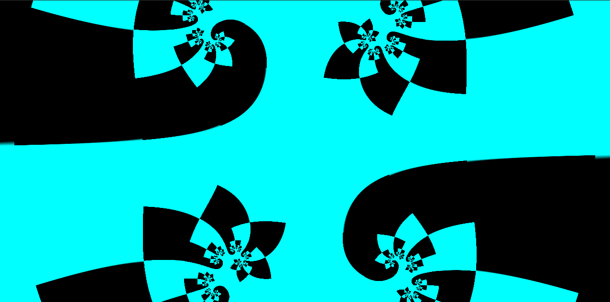

<!--
 * @Description:
 * @Author: Amamiya
 * @Date: 2022-04-12 15:39:05
 * TechChangeTheWorld
 * WHUROBOCON_Alright_Reserved
-->

# 作业 1--基于 juliaset 改一些东西

生成类似于水母的效果，顺便在改颜色的时候改出一个让人 san 值狂掉的东西

## 背景简介

源自于看到 gui.py 中关于 rgb 的描述后进行一些乱改

## 成功效果展示

## 运行方式

`python3 JuliaSetChangeColor.py`
`python3 JuliaSetJellyfish.py`

## 存在一些问题

不知道 rgb 项的值的取值范围和对应效果
